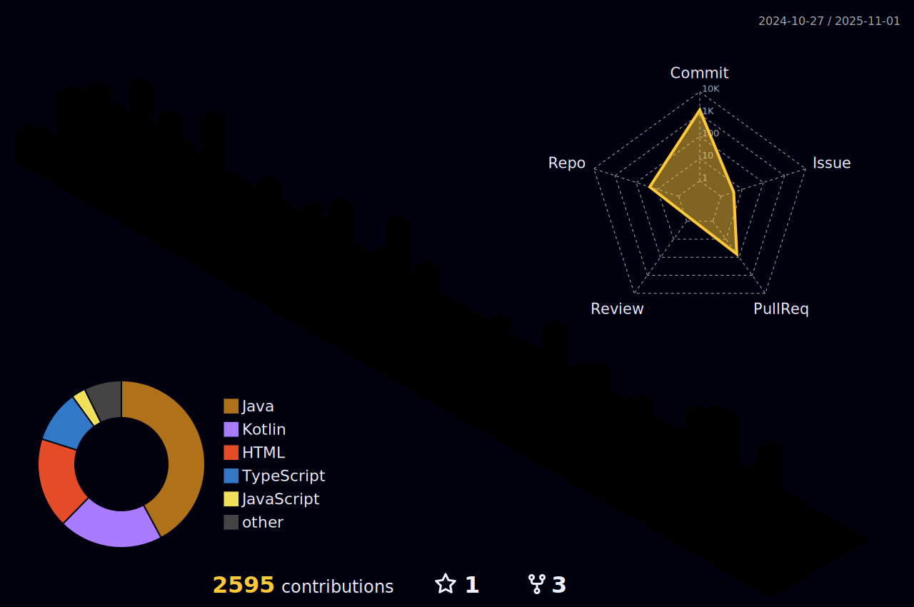

  

  

---

### 🧑‍💻 About Me

---

### 🚀 Tech Stack

#### Backend & Architecture

#### Mobile & Frontend

#### Databases

#### DevOps, Tools & OS

---

### 📊 Stats

  
  

---

### 🐍 Contributions

  

---

### 🌐 Connect with Me

  
  
  

